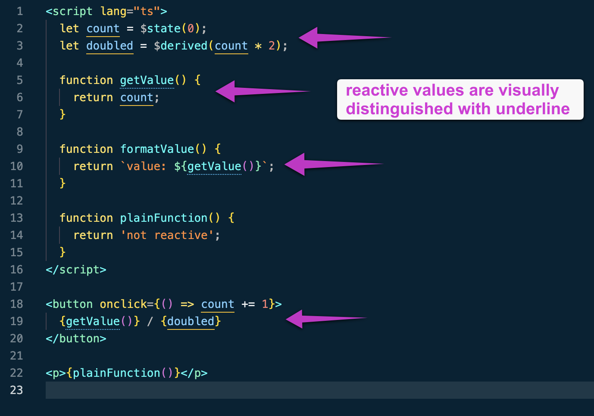

# Svelte Reactive Underlines

VS Code extension that underlines Svelte 5 reactive variables and functions.

## Preview



## Install

Download the latest `.vsix` from the GitHub Releases page, then install it:

```sh
code --install-extension svelte-reactive-underlines-0.0.1.vsix
```

Reload VS Code after installing.

## Debugging

Run `Svelte Reactive Underlines: Show Status` from the Command Palette to confirm the extension activated, indexed files, and found visible reactive variables/functions.

You can also open the Output panel and choose `Svelte Reactive Underlines`.

## What It Marks

- Variables initialized with Svelte 5 runes: `$state`, `$derived`, `$props`, `$bindable`.
- Class fields initialized with those runes.
- Functions, methods, getters, and named arrow functions that directly read reactive variables.
- References in `.svelte`, `.svelte.ts`, `.svelte.js`, `.ts`, and `.js` files.
- Svelte markup references inside `{...}` expressions.

Reactive variables use a solid bottom border. Reactive functions use a dotted bottom border. The extension uses bottom borders instead of native text underlines so the mark sits below the glyphs instead of crowding descenders.

## Avoiding Underline Sprawl

By default, `svelteReactiveUnderlines.callerPropagation` is `"off"`.

That means this is underlined:

```ts
let value = $state(0);

function getValue() {
  return value;
}
```

But this is not underlined just because it calls `getValue()`:

```ts
function label() {
  return `Value: ${getValue()}`;
}
```

If you want callers marked too, set:

```json
{
  "svelteReactiveUnderlines.callerPropagation": "oneHop"
}
```

or:

```json
{
  "svelteReactiveUnderlines.callerPropagation": "transitive"
}
```

`oneHop` marks direct callers of reactive functions. `transitive` keeps walking the call graph until stable. `off` is the recommended default because transitive mode can make large composed modules noisy.

## Prototype Limits

This first version uses a fast workspace index and name-based references. That keeps it simple and useful immediately, but it can produce false positives when unrelated files reuse the same variable or function name.

The production-grade version should move the reference layer to the TypeScript language service or Svelte language-tools so references are symbol-based instead of name-based.

## Run Locally

```sh
npm install
npm run compile
code .
```

Then press `F5` in VS Code to launch an Extension Development Host.

Open `samples/Counter.svelte` or `samples/state.svelte.ts` in the development host to test the underline behavior.

## Settings

- `svelteReactiveUnderlines.enabled`: enable or disable the extension.
- `svelteReactiveUnderlines.callerPropagation`: `"off"`, `"oneHop"`, or `"transitive"`.
- `svelteReactiveUnderlines.maxFiles`: maximum workspace files to index.
- `svelteReactiveUnderlines.variableUnderlineColor`: underline color for variables.
- `svelteReactiveUnderlines.functionUnderlineColor`: underline color for functions.

## Build a VSIX

```sh
npm install
npm run package
```
